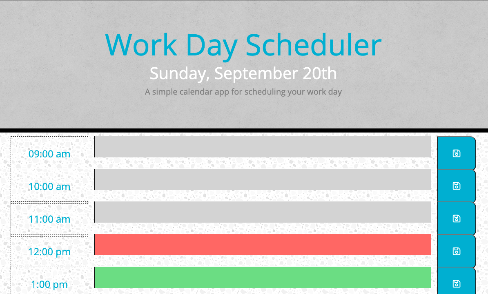

# Work Day Scheduler

## Description 
Plan your day ahead of time with this 9 hour day Work Day Scheduler. In this scheduler the user is aways able to  find the current day on top of the page. Depending on the time of day the scheduler will be red to allow the user to input thier current plans. User is able to add plans that already happened in the grey space and green for anything they'd like to do in the future. 
 

## Installation

There are no installations needed to use this Day Scheduler. The Day Scheduler should run directly in your browser on your computer or other devices.

This scheduler is free to use for everyone.

## Usage

